# Project Amazon PH Academy — SimGrid

A multi-page webapp that consolidates twelve live Amazon PPC training simulators, a teaching companion, and the completed VA Project PH simulator roadmap under one brand: **Project Amazon PH Academy**.

> Train the VAs who run Amazon PPC for a living.

Built from the eight chat-export JSONs in `../`. The extracted simulators now share
one design-system cascade: central brand tokens, simulator-specific layout CSS, the
unified skin, and the common application shell.

## Current platform status

- **12 live simulators** plus PPC Coach and the curriculum roadmap.
- **12 PPC Coach modules / 40 lessons**, with manifest-driven simulator assignments.
- Shared versioned attempt history surfaces Not started, In progress, Passed, best score, and attempt count in Coach and the hub.
- One tested beginner PPC policy aligns evidence bands, negatives, bid changes, and budget scaling across lessons and simulators.
- Scenario-bank infrastructure preserves stable simulator progress while recording the selected scenario and rubric versions; Campaign Architect and Account Audit now ship selectable beginner and intermediate packs.
- `node --test tests/*.test.cjs` is the primary regression command; the current baseline is **95 passing tests**.

## Design-system architecture

Every simulator and learning page loads presentation in the same order:

1. `assets/fonts.css` — one shared brand-font bundle.
2. `assets/tokens.css` — brand colors, typography, spacing, radii, and shadows.
3. A simulator stylesheet — native layout and simulator-specific components.
4. `assets/skin.css` — shared visual treatment without replacing simulator layout.
5. `assets/shell.css` — shared navigation and footer, backed by the central tokens.

Simulator HTML contains structure and behavior, not page-level `<style>` blocks.
`tests/design-system-contract.test.cjs` protects this dependency order and prevents
the inline monoliths or disconnected shell variables from returning.

The six newer graded simulators no longer share a generic page renderer. Each owns a
function-specific view and stylesheet: diagnostic sweep, decision cockpit, blueprint
canvas, signal lab, intake interview, or journey map. Shared view utilities are limited
to persistence, escaping, progress recording, focus, reduced motion, and responsive
interaction primitives; they do not define simulator layout.

The shared shell also resolves nested documentation paths, provides mobile navigation,
maintains 44px touch targets, respects reduced-motion preferences, and inserts a
keyboard-accessible skip link. Interactive buttons declare their behavior explicitly,
and all brand typography is delivered through the shared font tokens.

## Product context

**Live SimGrid:** https://projectamazonph.github.io/amazon-ph-simulators/

The simulator repository supports the wider Project Amazon PH course experience. The first image below is the separately hosted course home page; the remaining captures come from the verified GitHub Pages deployment of this repository.


## SimGrid gallery

| Hub | Guided curriculum |
|---|---|
| 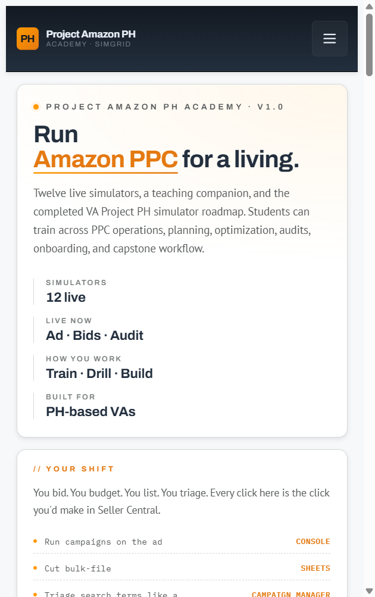 | 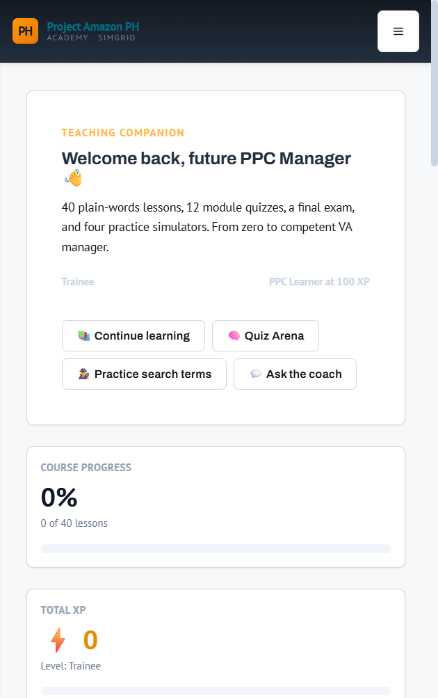 |

| Bid Decisions | SQP Studio |
|---|---|
| 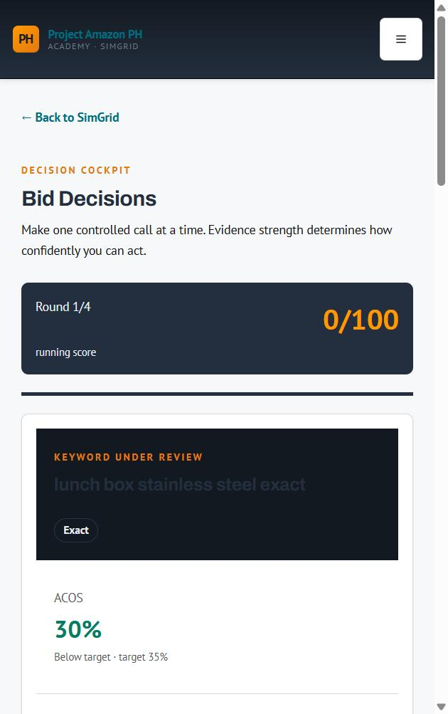 | 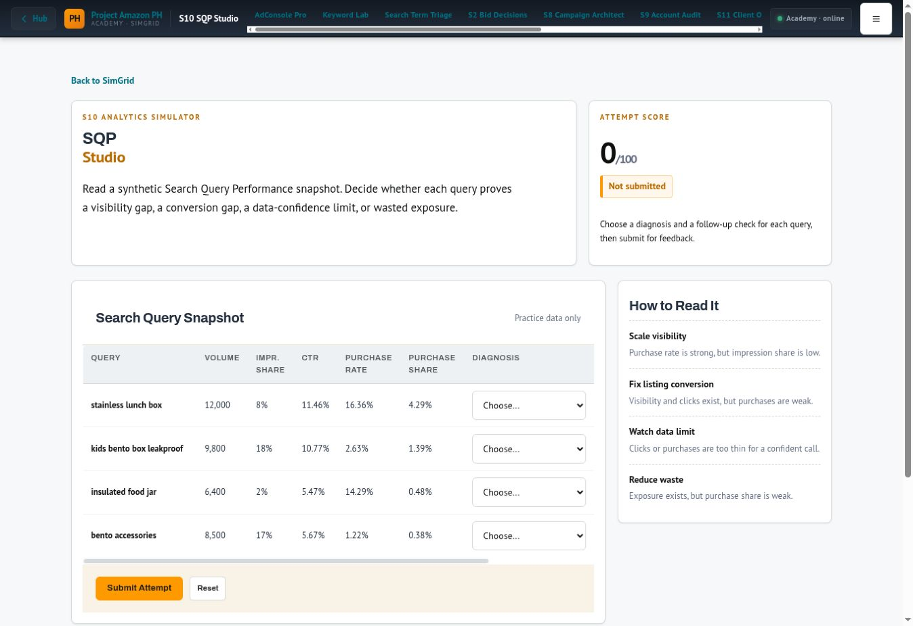 |

| AdConsole Pro | Capstone Sequence |
|---|---|
| 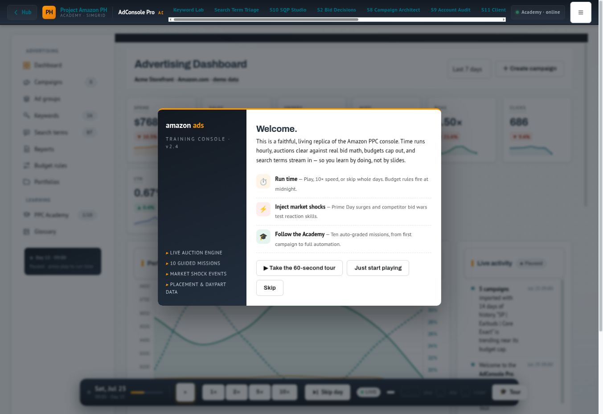 | 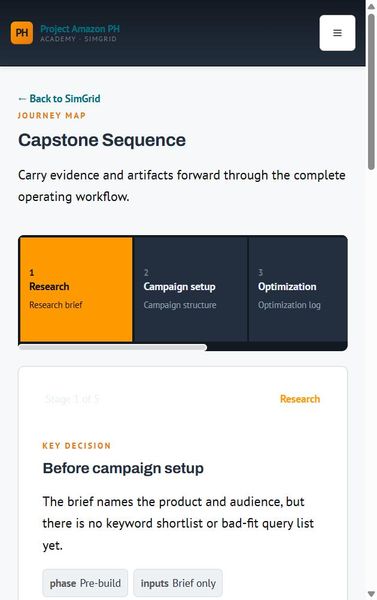 |

| Keyword Lab | Search Term Triage |
|---|---|
| 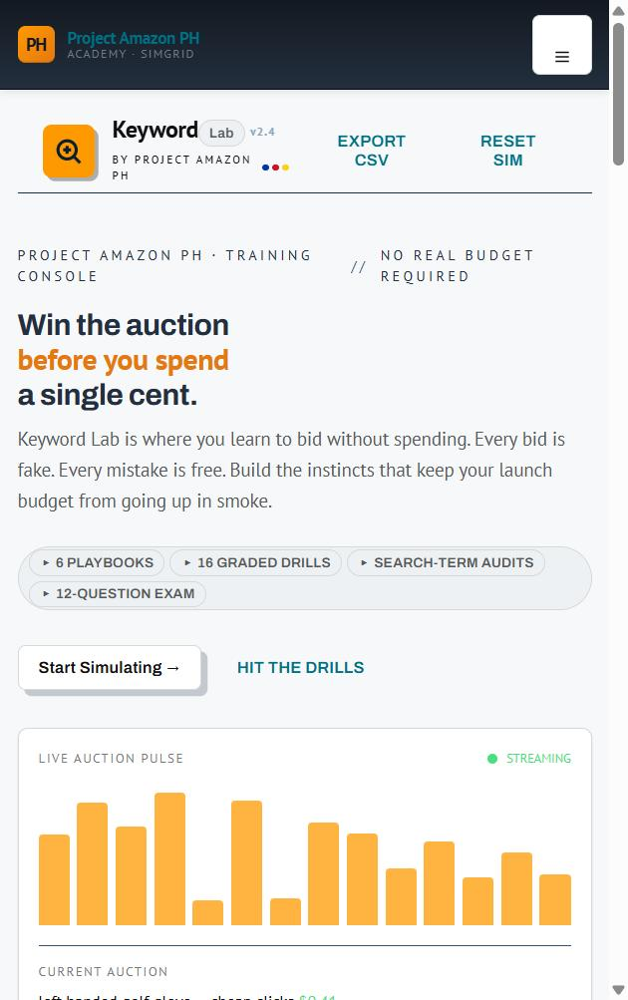 | 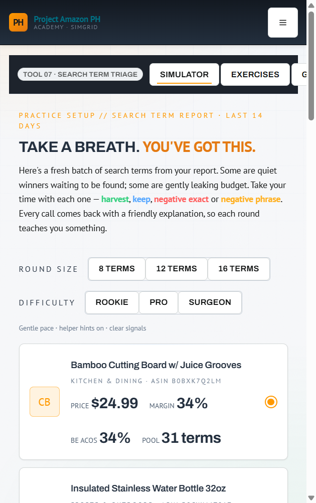 |

| Bulk File Simulator | BuyBox Dojo |
|---|---|
| 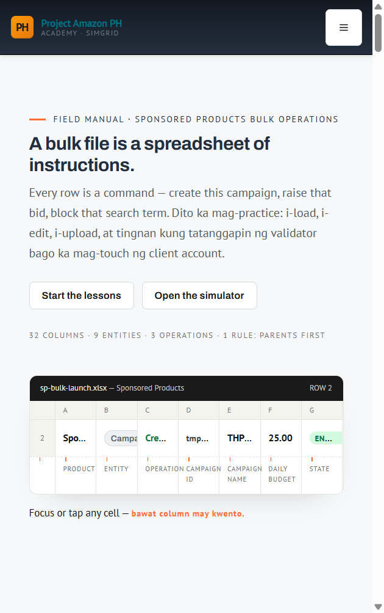 | 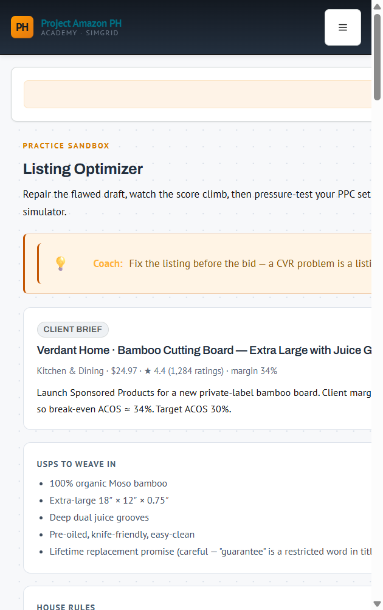 |

| Pacing Deck | Campaign Architect |
|---|---|
| 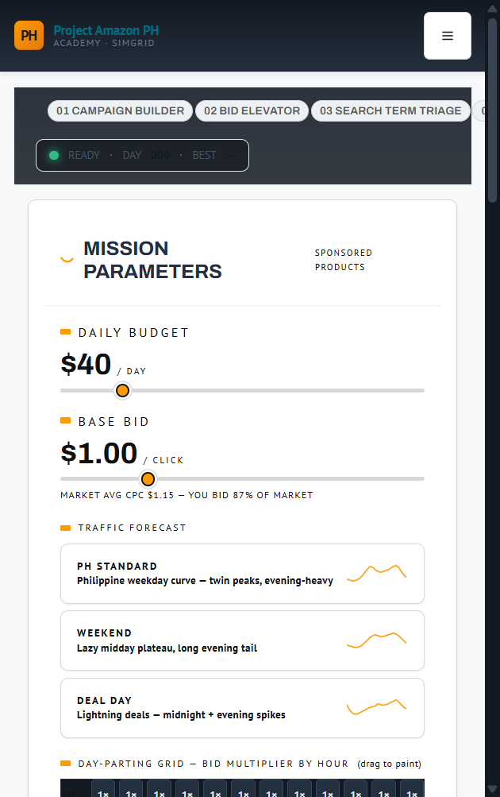 | 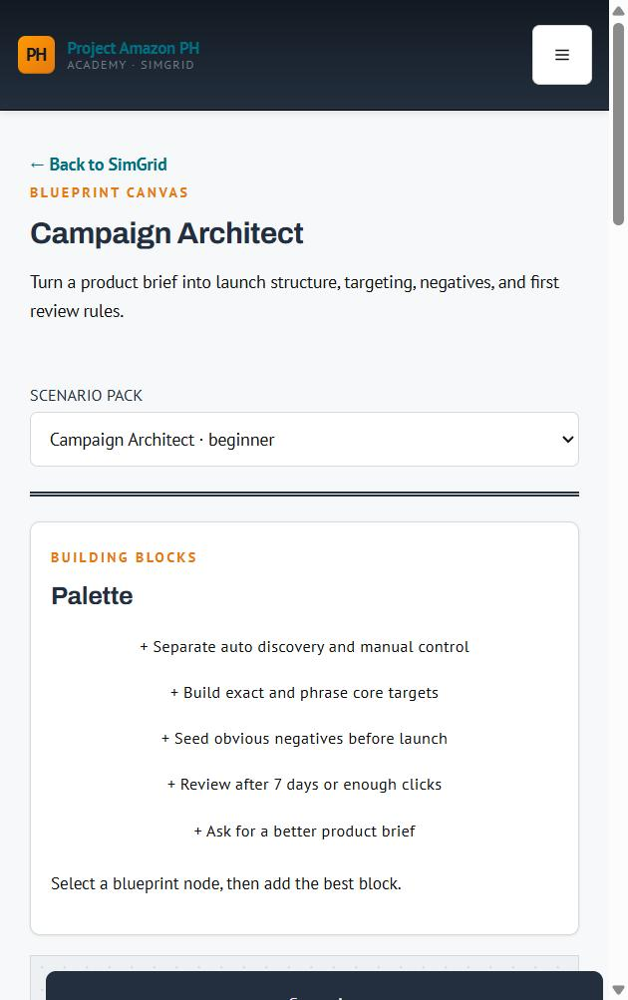 |

| Account Audit | Client Onboarding |
|---|---|
| 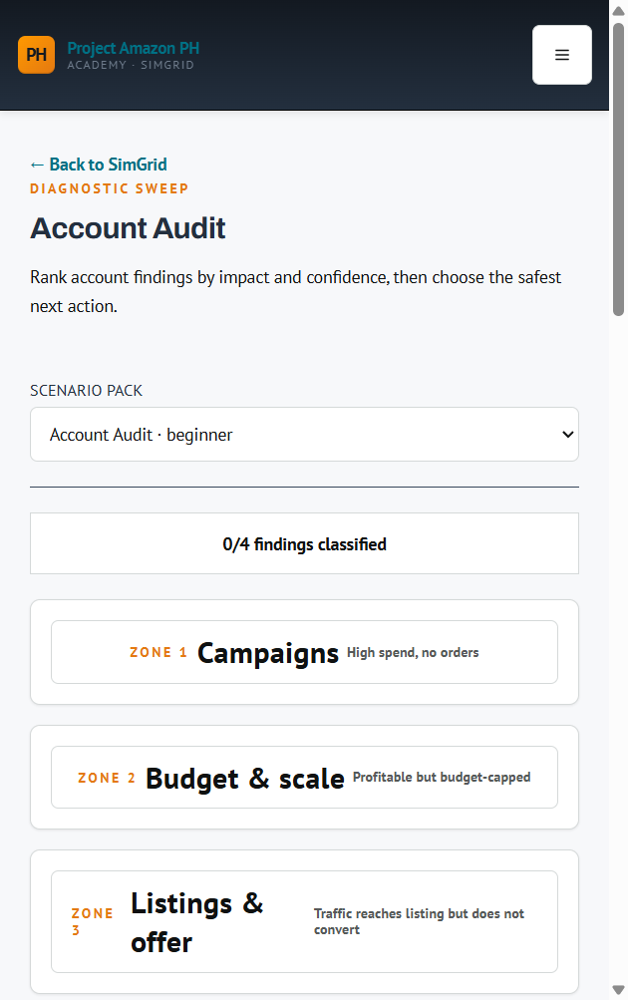 | 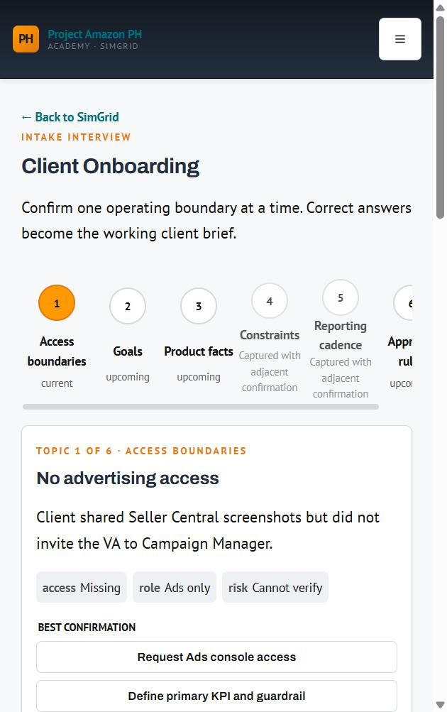 |

| Planned Simulators | Learn & Docs |
|---|---|
| 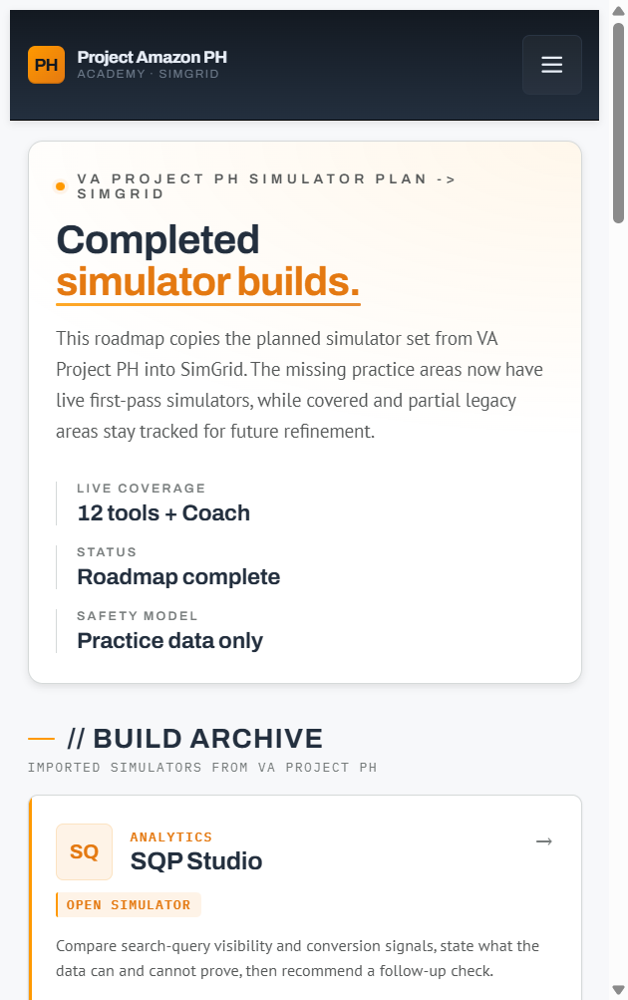 | 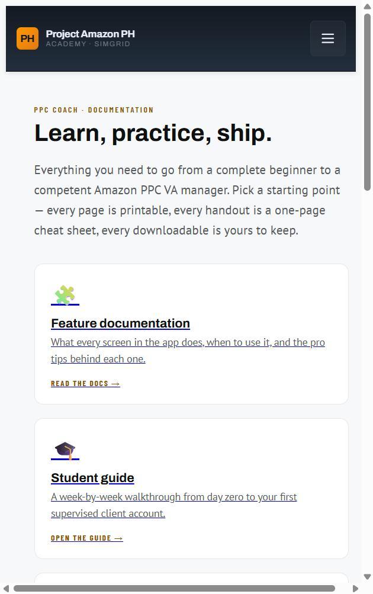 |

See [the screenshot guide](docs/screenshots/README.md) for source URLs and recapture standards.


---

## Planned simulator roadmap imported from VA Project PH

The planned simulator set from `projectamazonph/va-project-ph` is now tracked in SimGrid so future builds can happen here without losing the curriculum intent.

| Planned Simulator | SimGrid Status | Notes |
|---|---|---|
| S1 Search-Term Report Lab | Mostly covered | `search-triage.html` covers core search-term decisions |
| Bid Decisions | Live | `bid-decisions.html` teaches raise/hold/lower/investigate calls with tested scoring in `assets/bid-decisions-core.js` |
| S3 Budget and Pacing | Covered | `pacing-deck.html` |
| S4 Campaign Builder / Console Wizard | Partial | `ad-console.html` has setup flow; planned work adds stronger wizard/rubric |
| S5 Listing Audit | Partial | `listing.html` covers listing + PPC pressure test |
| S7 Bulk Operations | Covered | `bulk-file.html` |
| Campaign Architect | Live | `campaign-architect.html` teaches launch structure, targeting, negatives, and first review rules |
| Account Audit | Live | `account-audit.html` teaches account finding prioritization and safe next actions |
| SQP Studio | Live | `sqp-studio.html` reads SQP visibility/conversion signals with tested scoring in `assets/sqp-studio-core.js` |
| Client Onboarding | Live | `client-onboarding.html` teaches access, KPI, product brief, and approval requirements |
| Capstone | Live | `capstone-sequence.html` teaches the full research, setup, optimization, and reporting sequence |

All imported planned simulators now have live first-pass implementations. Current improvement work follows the curriculum synchronization plan: scenario banks, a persistent capstone, legacy mission/testing depth, then new simulator vertical slices.

---

## How to run

The project is a plain static webapp and also ships as a Windows desktop app.

### Windows installer

Download `SimGrid-Setup-1.0.3.exe` from the GitHub Actions artifact or the
published release and run it. The installer is per-user, creates a Start Menu
entry and desktop shortcut, and does not require administrator access by default.

Students do not need Node.js, Python, or a separate web server after installing
the app.

#### App details

| Item | Detail |
|---|---|
| App name | Project Amazon PH Academy SimGrid |
| Current release | `1.0.3` |
| Installer | `SimGrid-Setup-1.0.3.exe` |
| Platform | Windows 10/11, 64-bit |
| Install type | Per-user; administrator access is not normally required |
| App identity | `com.projectamazonph.simgrid` |
| Release source | [GitHub Releases](https://github.com/projectamazonph/amazon-ph-simulators/releases) |
| Web version | [projectamazonph.github.io/amazon-ph-simulators](https://projectamazonph.github.io/amazon-ph-simulators/) |

#### Student installation guide

1. Download the installer from the project’s GitHub Release.
2. Review the branded SimGrid information page shown by the installer. It
   explains the app, installation scope, updates, saved progress, and support
   links.
3. If Windows shows a SmartScreen warning, verify that the file came from the
   official repository before selecting **More info** and continuing. A signed
   release is preferred; unsigned builds may be shown as an unrecognized app.
4. Choose the installation folder, then finish the installer.
5. Launch **SimGrid** from the desktop shortcut or the **Project Amazon PH
   Academy** Start Menu group.
6. Start with **PPC Coach**, complete the lesson, then open the assigned simulator.

The installed app does not require Node.js, Python, or a local web server.

#### Updating the app

SimGrid checks for updates when a packaged Windows build starts. When a new
stable GitHub Release is available:

1. Choose **Download update** when prompted.
2. Wait for the download to complete.
3. Choose **Restart and install** to apply it, or choose **Later** and install
   when convenient.

If no prompt appears, close and reopen the app while connected to the internet.
Updates require releases to include the installer, `latest.yml`, and its
blockmap file. Development runs launched with `npm run start` do not check for
updates.

#### Saved progress and reinstall behavior

Progress is saved locally for the current Windows user. The desktop app stores
browser storage in:

```text
%APPDATA%\Project Amazon PH Academy SimGrid
```

Normal updates and reinstalling the same app identity preserve this folder. Do
not delete it if you want to keep progress. The in-app reset controls can still
clear progress intentionally. Progress is local to the Windows account and is
not automatically synchronized between different computers or browser profiles.

#### Troubleshooting

| Problem | Recommended action |
|---|---|
| App does not open | Reinstall the latest release and confirm Windows Defender did not quarantine it. |
| SmartScreen warning | Verify the download source and file checksum; use a signed release when available. |
| Update is not offered | Confirm the app is packaged, connected to the internet, and the new release includes `latest.yml`. |
| Progress is missing | Confirm you are using the same Windows account and app identity; do not clear the `%APPDATA%` folder. |
| External fonts or charts are missing | Connect to the internet; some resources are loaded from CDNs. |

### Run from source

Open the static site three ways:

```powershell
# 1. Just double-click
explorer "D:\Web Project\Simulators\webapp\index.html"

# 2. Or via PowerShell
Start-Process "D:\Web Project\Simulators\webapp\index.html"

# 3. Or serve it (recommended for full font fidelity)
cd "D:\Web Project\Simulators\webapp"
python -m http.server 8080
# then open http://localhost:8080/
```

No build step. No dependencies. No backend. Everything is in the page.

### Build the desktop app

Install Node.js 22.12 or newer, then run these commands from the repository root:

```powershell
npm install
npm run start       # launch the desktop wrapper
npm run dist:win   # create release\SimGrid-Setup-1.0.3.exe
```

The `Build Windows Installer` workflow in
`.github/workflows/build-windows-installer.yml` runs for pull requests targeting
`master`, pushes to `master`, and manual dispatches. It builds on `windows-latest`
and uploads an artifact named `simgrid-windows-installer` containing the NSIS
installer. This is the recommended way to produce a distributable installer from
Linux or macOS.

### Desktop updates

The packaged Windows app checks the GitHub Releases channel for updates when it
starts. If an update is available, it asks before downloading and asks again
before restarting to install it. To publish an update, increment the version in
`package.json`, build the NSIS installer, and attach the installer plus the
generated `latest.yml` and blockmap files to a GitHub Release. Releases must use
the `latest` stable channel and the same repository configured in
`package.json` under `build.publish`.

Auto-update is enabled only in packaged Windows builds. Development runs do not
contact the release service.

Student progress is stored in Electron's per-user data directory, separate from
the installed application files. The installer is configured not to remove that
directory during uninstall, so progress survives updates and reinstalling the
same app identity on the same Windows account. Clearing Windows app data or using
the reset controls inside SimGrid will still remove progress.

The wrapper loads the same local HTML, CSS, JavaScript, and learning materials as
the browser version. Student progress continues to use the browser's local storage,
now scoped to the installed SimGrid app. The pages still use their existing CDN
font, chart, spreadsheet, and image references, so an internet connection is needed
for those external resources when they are not already cached.

---

## Pages

| # | Page | File | What it does |
|---|------|------|--------------|
| — | **Hub** | `index.html` | Control grid - links to all live tools, simulator roadmap, mission panel, principles |
| — | **Simulator Roadmap** | `planned-simulators.html` | Roadmap copied from `va-project-ph` docs 36-42 for imported simulator builds |
| 1 | **AdConsole Pro** | `ad-console.html` | Amazon Sponsored Ads console replica — campaigns, ad groups, keywords, search terms, hour-by-hour auction simulation |
| 2 | **Keyword Lab** | `keyword-lab.html` | Keyword research training: playbooks, practice drills, search-term audits, 12-question certification exam |
| 3 | **Search Term Triage** | `search-triage.html` | 8/12/16-term triage rounds; read the report, decide the action, defend it. OPSDECK Practice Suite · Tool 07 |
| 4 | **Bulk File Simulator** | `bulk-file.html` | Upload bulk sheets, get graded like a real Amazon bulk upload |
| 5 | **BuyBox Dojo** | `listing.html` | Listing optimizer + 7-day PPC pressure test + VA Playbook |
| 6 | **Pacing Deck** | `pacing-deck.html` | Budget & day-parting simulator with 24-hour flight log |
| 7 | **SQP Studio** | `sqp-studio.html` | Search Query Performance simulator for visibility, conversion, uncertainty, and waste diagnosis |
| 8 | **Bid Decisions** | `bid-decisions.html` | Bid optimization simulator for raise, hold, lower, and investigate decisions |
| 9 | **Campaign Architect** | `campaign-architect.html` | Campaign-map simulator for structure, targets, negatives, and first review plans |
| 10 | **Account Audit** | `account-audit.html` | Account snapshot simulator for prioritizing findings and safe next actions |
| 11 | **Client Onboarding** | `client-onboarding.html` | VA workflow simulator for access, goals, product facts, and approvals |
| 12 | **Capstone Sequence** | `capstone-sequence.html` | Workflow simulator covering research, setup, optimization, and reporting |

---

## Curriculum map

SimGrid is designed as a practice environment for Amazon PPC assistants and
junior campaign managers. The tools are deliberately hands-on: students change
inputs, make operating decisions, see the consequence, and explain the decision.

### The twelve simulators

#### 1. AdConsole Pro — operate the advertising console

AdConsole Pro is the closest simulator to a day-to-day Sponsored Ads console.
Students work across campaigns, ad groups, advertised products, keywords, and
search terms while the auction engine advances through simulated time.

- Create a campaign through a five-step setup flow.
- Edit campaign budgets, bidding strategies, statuses, portfolios, ad-group bids,
  and keyword bids.
- Inspect performance charts, spend, orders, CPC, ACOS, and live activity.
- Read search terms and decide whether to harvest them into Exact or add them as
  negatives.
- Use hourly day-parting, placement bid adjustments, budget rules, and market
  events to practice reacting to changing conditions.
- Generate reports and complete Academy missions that teach the operator workflow.

#### 2. Keyword Lab — research before spending

Keyword Lab teaches students how to build a keyword set before putting budget
behind it. It combines guided lessons, a bid-and-profit simulator, reusable
playbooks, drills, and certification.

- Load and compare six sample keyword playbooks.
- Test match types, bids, budgets, market conditions, and product economics.
- Estimate spend, revenue, orders, CPC, CTR, ACOS, and net profit after COGS.
- Use the max-bid and break-even calculators to connect conversion rate, AOV,
  target ACOS, and allowable CPC.
- Complete practice drills covering search-term decisions, keyword selection,
  negatives, match types, bid logic, and profitability.
- Take the 12-question certification exam, with an 80% passing target.

#### 3. Search Term Triage — make the call on every query

Search Term Triage is a decision-practice suite for turning a search-term report
into a clear action. It rewards judgment, not just memorizing rules.

- Work through timed or self-paced 8/12/16-term triage rounds.
- Read a search-term row and select the appropriate keep, harvest, monitor, or
  negative action.
- Use difficulty modes, hints, progress ranks, XP, explanations, and a rubric to
  understand why an answer is right.
- Practice five focused drills: Listing Autopsy, Bid Ladder, Search Term Triage,
  Daypart Decoder, and Review Radar.
- Learn the supporting concepts through the five-question guide, search-term
  sources, break-even ACOS, negative exact versus negative phrase, harvesting,
  and common traps.

#### 4. Bulk File Simulator — move changes safely at scale

Bulk File Simulator teaches the spreadsheet workflow behind large Amazon Ads
changes. It grades the file like a real upload instead of treating a spreadsheet
as a passive template.

- Learn the complete Download → Edit → Upload → Process → Verify workflow.
- Understand parent-child order: Portfolio → Campaign → Ad Group → child rows.
- Create new entities with temporary IDs and reference those IDs from child rows.
- Use real account IDs for Update and Delete operations rather than names.
- Upload or load clean, broken, and update samples in the validator.
- Receive row-level validation feedback and download templates and sample files.
- Convert search-term decisions into a bulk file, build a launch file from a blank
  sheet, and compare the result with a mentor model answer.
- Use the field guide, common-mistakes reference, and glossary before touching a
  client account.

#### 5. BuyBox Dojo — improve the listing and pressure-test the PPC

BuyBox Dojo joins listing quality and advertising performance on the same ASIN.
It teaches the student to fix the page before blaming the campaign.

- Edit the title, five bullets, product description, backend search terms, and
  listing inputs with character counters and a mobile preview.
- Reveal a model answer or reset to a flawed draft for deliberate practice.
- Research target keywords, choose match types, add negatives, and auto-build a
  starter campaign.
- Run a seven-day PPC pressure test and inspect impressions, clicks, CTR, CPC,
  spend, sales, orders, ACOS, and ROAS.
- Complete the What Would You Do? decision drills and earn XP for safe actions.
- Use the VA Playbook, weekly report and client-communication templates, PPC
  dictionary, and final quiz to connect the exercise to real work.

#### 6. Pacing Deck — protect budget across the day

Pacing Deck is a 24-hour Sponsored Products flight simulator. Students see how
bid, budget, demand, and day-parting interact instead of treating daily budget as
an isolated number.

- Set mission parameters such as bid and daily budget.
- Run the day hour by hour and follow spend, remaining budget, impressions,
  clicks, orders, CPC, and the flight log.
- Read the hourly demand pattern and decide when to ease off or boost bids.
- Compare the plan against the market average CPC and forecast conditions.
- Review the end-of-day score and report, then rerun with the Night Owl scenario
  or tune the settings for another attempt.

#### 7. SQP Studio (`sqp-studio.html`)

SQP Studio is the first planned simulator promoted into the live hub. Students read a synthetic Search Query Performance snapshot and diagnose each query as a visibility gap, conversion gap, data-confidence limit, or wasted exposure.

Key implementation notes:

- `assets/sqp-studio-core.js` owns SQP metrics, answer keys, scoring, and feedback.
- `sqp-studio.html` owns UI rendering, attempt storage, and interaction wiring.
- `tests/sqp-studio-core.test.cjs` verifies the scoring behavior.
- `tests/hub-links.test.cjs` protects the hub/nav slot.

#### 8. Bid Decisions (`bid-decisions.html`)

Bid Decisions isolates bid judgment from the larger ad console. Students read keyword-level bid, clicks, spend, orders, ACOS, and ROAS, then choose the safest bid action and confidence level.

Key implementation notes:

- `assets/bid-decisions-core.js` owns bid metrics, answer keys, scoring, and feedback.
- `bid-decisions.html` owns UI rendering, attempt storage, and interaction wiring.
- `tests/bid-decisions-core.test.cjs` verifies the scoring behavior.
- `tests/hub-links.test.cjs` protects the hub/nav slot.

#### 9. Campaign Architect (`campaign-architect.html`)

Campaign Architect turns a product brief into a campaign launch plan. Students choose the right structure, targeting, negative guardrails, and first review rule across selectable beginner and intermediate scenarios.

Key implementation notes:

- `assets/campaign-architect-core.js` owns two versioned scenarios, answer keys, and feedback through the shared scenario bank.
- The page uses the shared `assets/decision-simulator-page.js` renderer and `assets/decision-simulator-core.js` scoring contract.
- `tests/remaining-simulators-core.test.cjs` verifies full-credit and judgment-edge cases.

#### 10. Account Audit (`account-audit.html`)

Account Audit teaches account-level prioritization across selectable beginner and intermediate scenarios. Students separate urgent waste, scale opportunities, tracking risk, listing friction, and thin data before recommending a next action.

Key implementation notes:

- `assets/account-audit-core.js` owns two versioned audit scenarios and their shared priority rubric.
- The shared decision renderer provides local attempt storage and row-by-row coaching.
- `tests/remaining-simulators-core.test.cjs` verifies waste and thin-data behavior.

#### 11. Client Onboarding (`client-onboarding.html`)

Client Onboarding practices the VA handoff. Students identify access blockers, KPI guardrails, missing product facts, and approval rules before launch work starts.

Key implementation notes:

- `assets/client-onboarding-core.js` owns the onboarding checklist scenario.
- Shared scoring rewards both the onboarding move and the requirement level.
- `tests/remaining-simulators-core.test.cjs` verifies blocker calls for access and KPI gaps.

#### 12. Capstone Sequence (`capstone-sequence.html`)

Capstone Sequence ties the simulator set together. Students choose the right action at the right stage across research, setup, optimization, and client reporting.

Key implementation notes:

- `assets/capstone-sequence-core.js` owns the capstone scenario.
- The page uses the shared final-batch renderer so future capstone revisions can focus on scenario depth.
- `tests/remaining-simulators-core.test.cjs` verifies stage/action sequencing.

### PPC Coach — the teaching companion

PPC Coach is the structured course inside SimGrid: **12 modules, 40 plain-language
lessons, 12 module quizzes, a 15-question final exam, a glossary, four practice
tools, an AI Coach, badges, XP, and a teacher cohort view**. The module sequence is
intended to be followed in order.

1. **Amazon Basics** — the marketplace, product listings, visibility, organic
   versus paid traffic, and the Buy Box.
   Lessons: What is Amazon Marketplace?; Anatomy of a Product Listing; Organic vs
   Paid and the Buy Box.
2. **What is PPC?** — pay-per-click in plain language, the auction, relevance,
   placements, and the shopper click journey.
   Lessons: Pay Per Click in Plain Words; The Auction; The Click Journey and the
   Funnel.
3. **Money Math** — spend, sales, CPC, CTR, conversion rate, ACOS, ROAS, TACoS,
   break-even, and worked examples.
   Lessons: Spend, Sales and CPC; CTR and Conversion Rate; ACOS Deep Dive; ROAS,
   TACoS and a Full Worked Example.
4. **Campaign Structure** — the campaign/ad-group/targeting hierarchy, naming,
   organization, and Sponsored Products, Sponsored Brands, and Sponsored Display.
   Lessons: The Hierarchy: Campaign, Ad Group, Targeting; Naming and Organization;
   The Three Ad Types.
5. **Keywords & Match Types** — keywords versus search terms, broad, phrase,
   exact, negatives, and a repeatable research process.
   Lessons: Keyword vs Search Term; Match Types Deep Dive; Negative Keywords;
   Keyword Research Starter Process.
6. **Listing Readiness** — why PPC cannot rescue a weak product page and how to
   diagnose conversion leaks before spending.
   Lessons: The Listing Does the Selling; The Readiness Checklist; Diagnosing
   Conversion Leaks.
7. **Campaign Setup** — Auto versus Manual, a safe starter structure, and a
   four-week new-product launch plan.
   Lessons: Auto vs Manual Campaigns; A Safe First Structure; New Product Launch
   Plan.
8. **Bids & Budgets** — budget math, beginner bid rules, and a controlled bid-change
   walkthrough.
   Lessons: Budget Basics; Bid Rules for Beginners; A Bid Change Walkthrough.
9. **Search Terms & Negatives** — read the search-term report, separate winners
   from wasters, and run the weekly harvest loop.
   Lessons: Reading the Search Term Report; Winners and Wasters; The Harvesting
   Workflow.
10. **Weekly Optimization** — the operating cadence, one-change-at-a-time testing,
    and deciding when enough data has accumulated.
    Lessons: The Weekly Routine; One Change at a Time; How Much Data is Enough?
11. **Reporting & Troubleshooting** — write reports humans understand and diagnose
    no impressions, low CTR, clicks without sales, high ACOS, and sales drops.
    Lessons: The Simple Report Structure; Explaining Numbers in Human Words;
    Troubleshooting: No Impressions and Low CTR; Troubleshooting: Clicks No Sales,
    High ACOS, Sales Drop.
12. **VA Workflow & Capstone** — daily/weekly/monthly cadence, permissions,
    SOPs, change logs, client communication, and the final operating project.
    Lessons: Tasks by Cadence; The Permissions Ladder; SOPs and the Change Log;
    Client Communication and the Capstone.

#### PPC Coach module screenshots

The gallery below shows the learning view students use for each module. Each
screen includes the module overview, lesson list, and module quiz entry point.

<table>
<tr>
<td width="50%"><strong>1. Amazon Basics</strong><br></td>
<td width="50%"><strong>2. What is PPC?</strong><br>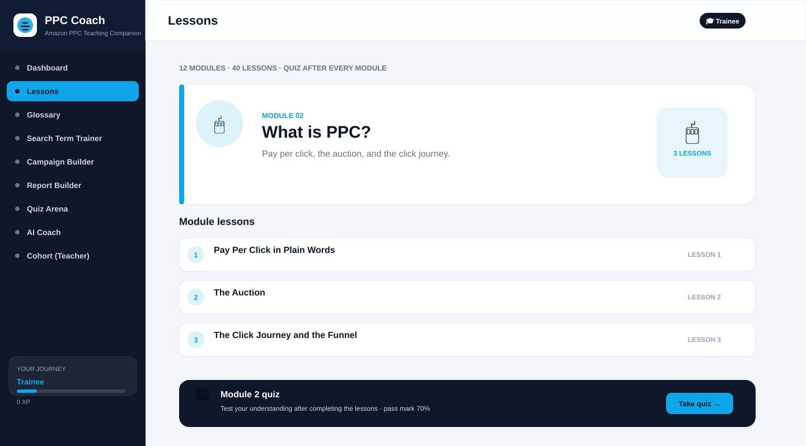</td>
</tr>
<tr>
<td><strong>3. Money Math</strong><br>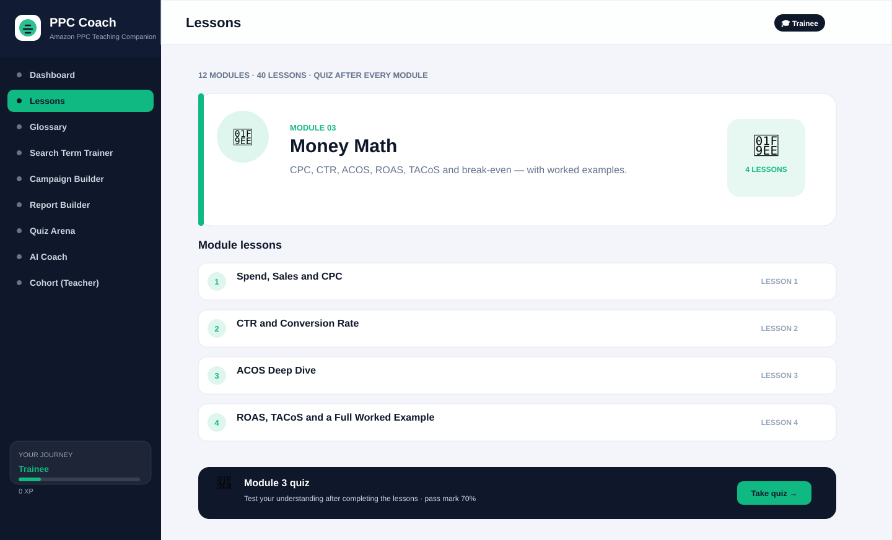</td>
<td><strong>4. Campaign Structure</strong><br>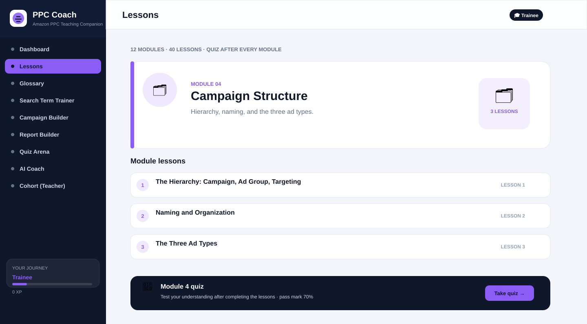</td>
</tr>
<tr>
<td><strong>5. Keywords &amp; Match Types</strong><br>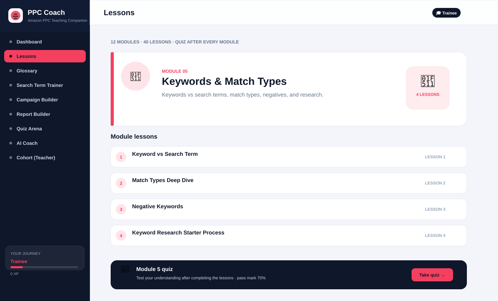</td>
<td><strong>6. Listing Readiness</strong><br>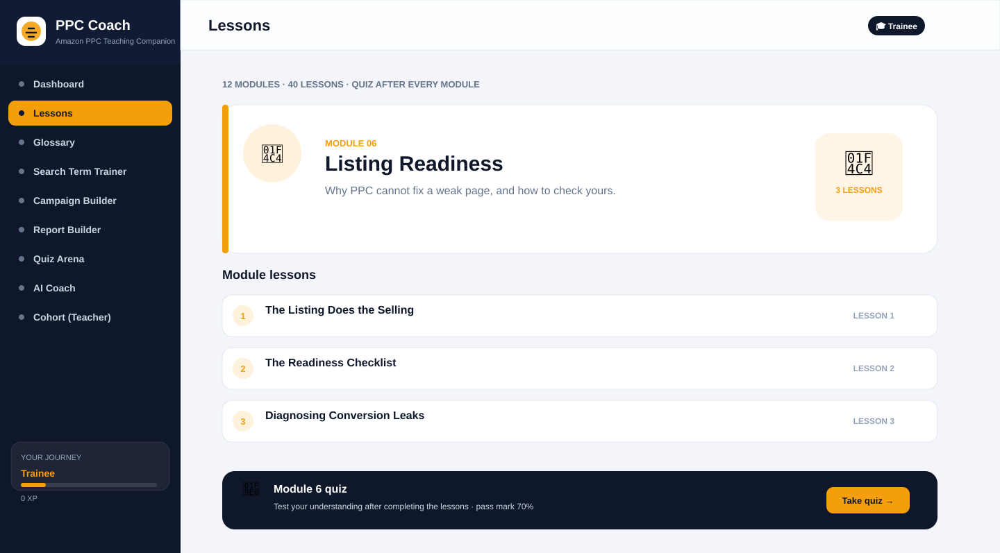</td>
</tr>
<tr>
<td><strong>7. Campaign Setup</strong><br>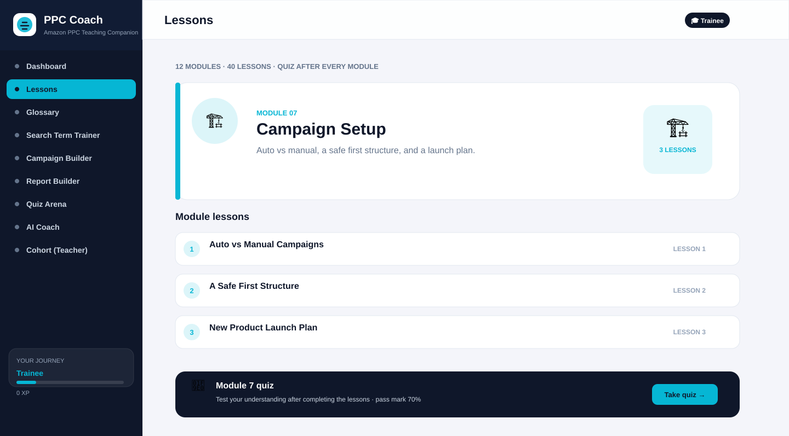</td>
<td><strong>8. Bids &amp; Budgets</strong><br>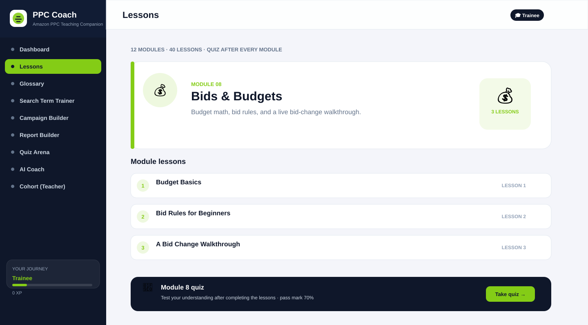</td>
</tr>
<tr>
<td><strong>9. Search Terms &amp; Negatives</strong><br>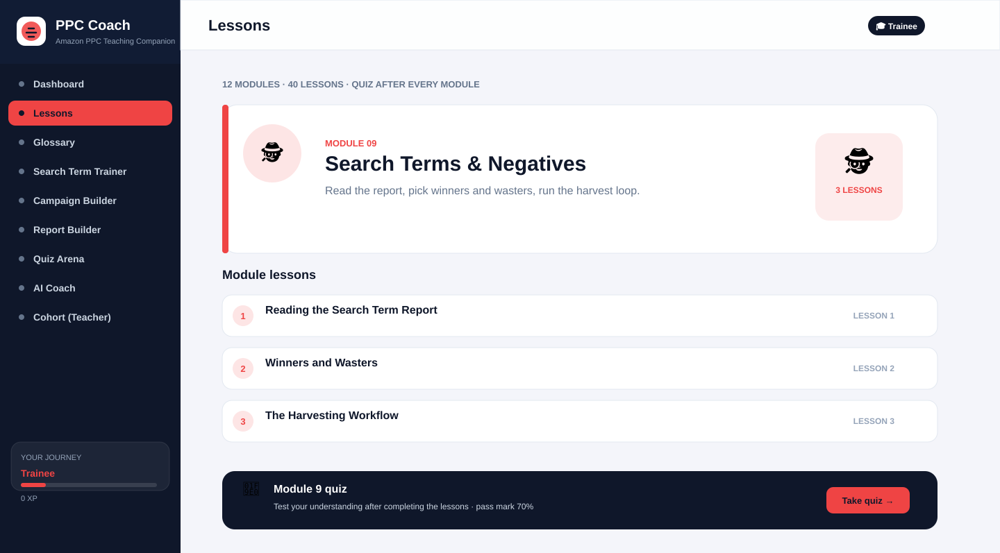</td>
<td><strong>10. Weekly Optimization</strong><br>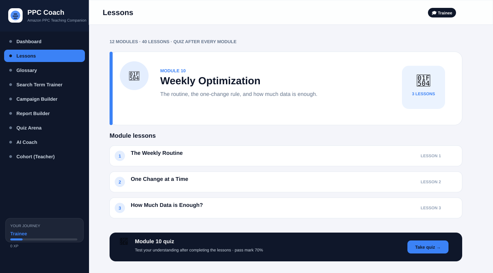</td>
</tr>
<tr>
<td><strong>11. Reporting &amp; Troubleshooting</strong><br>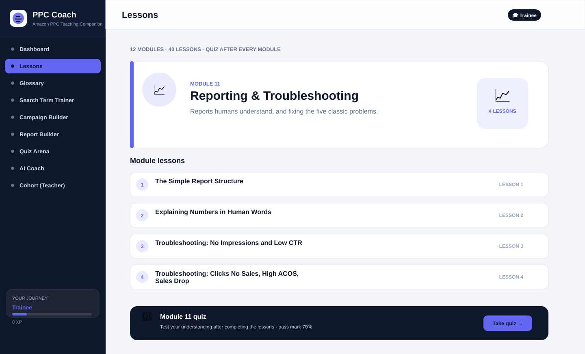</td>
<td><strong>12. VA Workflow &amp; Capstone</strong><br>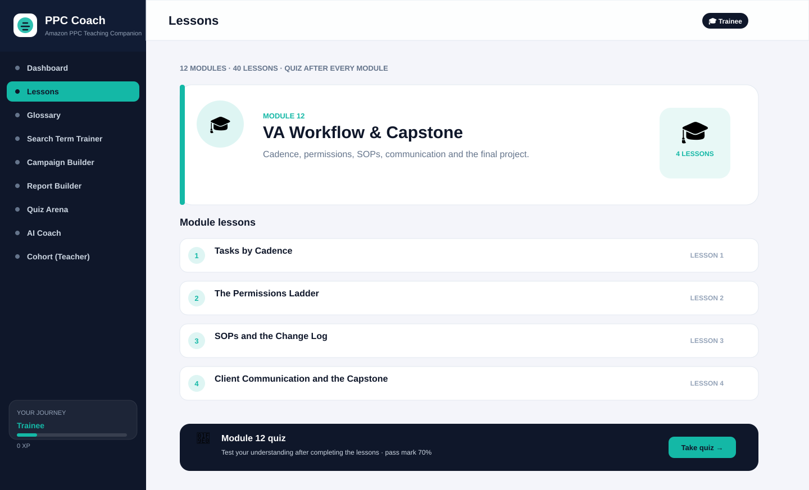</td>
</tr>
</table>

### PPC Coach workspace modules

The course content is supported by these in-app work areas:

- **Dashboard** — XP, level, lesson progress, quiz progress, badges, next lesson,
  and a recommended starting point.
- **Lessons** — the 12-module course, completion tracking, lesson XP, and a quiz
  after each module.
- **Glossary** — quick explanations for core PPC vocabulary and report language.
- **Search Term Trainer** — repeated search-term classification practice with a
  best score and feedback.
- **Campaign Builder** — build starter campaigns for practice products and receive
  a structured score.
- **Report Builder** — turn sample metrics into a plain-language weekly report.
- **Quiz Arena** — 12 module quizzes plus the 15-question Final Exam; module pass
  mark is 70% and the final exam is the capstone assessment.
- **AI Coach** — ask questions in plain language and receive guided prompts for
  the concepts being practiced.
- **Cohort (Teacher)** — review cohort average, at-risk students, top performers,
  progress, XP, weak areas, activity recency, and status.

### Learn & Docs

- **Features** — an instructor-oriented reference for each major Coach capability.
- **Student Guide** — a six-phase path from orientation to supervised on-the-job
  operation, with exit checks and a graduation checklist.
- **Printable Handouts** — eight one-page references: ACOS, match types, bids and
  budgets, search-term mining, the four-week launch plan, VA cadence,
  troubleshooting, and weekly reporting.
- **Downloads** — the standalone PPC Coach HTML, VA Starter Kit, four-week launch
  plan, and printable handout pack, plus instructions for saving pages as PDF.

---

## Architecture

```
webapp/
├── index.html           # Hub (Amazon Pro theme)
├── ad-console.html      # Tool — re-skinned via skin.css
├── keyword-lab.html     # Tool — re-skinned via skin.css
├── search-triage.html   # Tool — re-skinned via skin.css
├── bulk-file.html       # Tool — re-skinned via skin.css
├── listing.html         # Tool — re-skinned via skin.css
├── pacing-deck.html     # Tool — re-skinned via skin.css
└── assets/
    ├── tokens.css       # Single source of truth (colors, fonts, spacing, shadows, breakpoints, fluid type, touch targets)
    ├── skin.css         # Aggressive overrides — forces every tool onto the unified theme
    ├── responsive.css   # Mobile-first layer (auto-injected by shell.js) — hamburger nav, fluid type, 44px touch targets, .stack-mobile + .table-scroll utilities, print + reduced-motion
    ├── shell.css        # Top bar + footer chrome (the consistent frame)
    ├── shell.js         # Auto-injects chrome + responsive layer, builds nav, wires hamburger + scrim, applies skin
    ├── hub.css          # Hub-page-specific layout (hero, tool grid, principles)
    └── (the tool HTMLs keep their original CSS, but the skin overrides win)
```

### How the unification works

Each tool page's body class is set to `pha-skin` (auto-applied by `shell.js`).
Inside `assets/skin.css`, every tool-internal element is overridden onto the
unified design tokens. The tool's **JS still works** (we don't touch it),
but its **visual surface** is forced to use the same colors, fonts, spacing,
and component styles as every other page.

The flow:

1. `tokens.css` defines the design system (CSS custom properties)
2. The tool's original CSS loads (defines its own dark/colorful styles)
3. `skin.css` loads last and overrides the tool's colors, fonts, surfaces
4. `responsive.css` loads after skin and applies the mobile-first layer
5. `shell.css` adds the top bar + footer
6. `hub.css` styles the hub page
7. The result: same look on every page, responsive across all sizes

---

## Design system

The unified theme is "**Amazon Pro**" — a clean, professional, Amazon-inspired
design language that mirrors the real Seller Central aesthetic, so VAs feel at
home.

### Responsive breakpoints (new in v1.1)

| Token        | Value  | Use |
|--------------|--------|-----|
| `--bp-sm`    | 480px  | small phones → large phones |
| `--bp-md`    | 768px  | tablet portrait threshold |
| `--bp-lg`    | 1024px | tablet landscape / small desktop |
| `--bp-xl`    | 1280px | wide desktop |
| `--tap`      | 44px   | WCAG 2.5.5 / Apple HIG min touch target |
| `--nav-h`    | 56px   | shared with topbar height |

### Fluid typography

| Token      | Formula                                | Use |
|------------|----------------------------------------|-----|
| `--fs-body`| `clamp(0.875rem, 0.8rem + 0.4vw, 1rem)` | body text |
| `--fs-h1`  | `clamp(1.75rem, 1.2rem + 2.6vw, 2.5rem)`| h1 |
| `--fs-h2`  | `clamp(1.25rem, 1rem + 1.2vw, 1.5rem)` | h2 |
| `--fs-h3`  | `clamp(1.0625rem, 0.95rem + 0.6vw, 1.25rem)` | h3 |

### Breakpoint behaviour

**Mobile (< 768px):**
- All sections stack vertically (1 column for `.pha-tools`, `.pha-principles`, `.pha-hero`)
- Navigation collapses into a hamburger drawer with scrim, ESC-to-close, focus-trap
- Touch targets enforced at 44px min on buttons, inputs, nav links
- Footer stacks vertically; meta line gets full width

**Tablet (768px – 1023.98px):**
- 2-column grid for tools and principles
- Hero stays 2-column (main + side)
- Nav becomes a horizontal scroll (no hamburger)

**Desktop (≥ 1024px):**
- Original layout preserved (3-column tool grid, 4-column principles)

### Utilities (new in v1.1)

- **`.stack-mobile`** — wrap any block to force 1-col layout at `<768px` regardless of its native grid/flex template.
- **`.table-scroll`** — wrap any wide table to get horizontal scroll on mobile instead of overflowing the page. Pair with **`.table-scroll-wrap`** to show a fade hint when content overflows (auto-detected via JS).

### Color tokens

| Token | Value | Use |
|-------|-------|-----|
| `--c-navy-2` | `#131921` | Brand primary, PHA top bar |
| `--c-orange` | `#FF9900` | Accent, primary buttons, highlights |
| `--c-bg` | `#F7F8FA` | Page background |
| `--c-card` | `#FFFFFF` | Card / panel surface |
| `--c-ink` | `#0F1111` | Primary text |
| `--c-sub` | `#565959` | Secondary text |
| `--c-faint` | `#767B7B` | Tertiary text |
| `--c-link` | `#007185` | Amazon link blue |
| `--c-green` | `#067D62` | Success / positive delta |
| `--c-amber` | `#C45500` | Warning / coach tip |
| `--c-red` | `#B12704` | Error / negative delta |

### Typography

- **Display**: `Archivo` (400/500/600/700/800) — sharp, modern, professional
- **Body**: `PT Sans` (400/700) — humanist, legible
- **Mono**: `IBM Plex Mono` (400/500/600) — technical, ops-deck feel
- **Condensed**: `Barlow Condensed` (500/600/700) — for tight UI labels

### Spacing

4px base. Use `--sp-1` (4) through `--sp-16` (64).

### Component patterns

- **Buttons**: rounded 6px, `btn-primary` (orange), `btn-ghost` (link), `btn-danger` (red)
- **Cards**: 8px radius, 1px border, soft shadow
- **Tables**: striped header, hover orange-soft
- **Inputs**: rounded 6px, focus ring orange
- **Chips**: pill, semantic colors (ok/warn/err)
- **Sidebar nav**: light surface, hover bg-2, active orange-soft with orange left bar

---

## Brand voice

- **Parent brand**: Project Amazon PH Academy
- **Hub name**: SimGrid (manifest-driven, can register new simulators via
  `window.APHSimHub.register()`)
- **Tagline**: "Train the VAs who run Amazon PPC for a living."
- **Tone**: Confident, training-focused, slightly tactical. Operator vocabulary
  (campaigns, ad groups, match types, day-parting, ACoS, TACoS, search-term
  harvest). No demo data. No participation trophies.

---

## Source

Every tool was extracted from one of these conversations in `../`:

| Conversation | Tool extracted |
|--------------|----------------|
| `chat-export-1786082534142.json` & `…5835.json` | Keyword Lab (branch + main) |
| `chat-export-1786082577736.json` | (SimGrid hub design) |
| `chat-export-1786082600081.json` | Bulk File Simulator |
| `chat-export-1786082615619.json` | BuyBox Dojo |
| `chat-export-1786082624608.json` | Search Term Triage |
| `chat-export-1786082634879.json` | AdConsole Pro |
| `chat-export-1786082566954.json` | (insights → Pacing Deck) |

Working artifacts:

- `../_extracted/` — every HTML block pulled from the JSONs (36 files)
- `../_audit/` — internal notes (not user-facing)

---

## How a new tool gets added

Two options:

1. **Drop a new HTML file in `webapp/`** with `data-pha-tool="your-id"` on
   `<body>`, link `assets/shell.css` and `assets/shell.js`, and add an entry to
   the `TOOLS` array in `assets/shell.js`. The chrome + skin will pick it up.
2. **Register dynamically** from the hub via the SimGrid manifest API
   (`window.APHSimHub.register(manifest)`) — same seam, just runtime.
